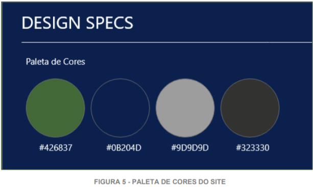

# Fundamentos

## Plataforma Alvo
>- Internet Explorer 11, Edge 44 e Chrome 77 e acima
>- Dispositivos Móveis:  Android 8 (Oreo) ou superior e iOS 13 ou superior

## Componentes de Acessabilidade
>- auto contraste
>- aumento de fonte
>- redução de fonte

## Acesso Anônimo
!> Não é permitido acesso anônimo

## Exposição para internet
!> Esta aplicação estará disponível para acesso via internet, mediante autenticação.

## Identidade Visual
### Fonte
>Família: Segoe UI

| **Local**                                  | **Fonte**    | **Formato**  | **Tamanho**                                 |
|:------------------------------------------:|:------------:|:------------:|:-------------------------------------------:|
| Título de Componente na Home               | Segoe UI     | Light        | 23                                          |
| Título de Página Interna                   | Segoe UI     | Regular      | 30                                          |
| Subtítulo em Componente(Clipping e Cursos) | Segoe UI     | Semibold     | * 25 (na página interna) * 17 (na Home)     |
| Texto Padrão                               | Segoe UI     | Light        | 20                                          |

## Cores
> As cores a serem utilizadas na Masterpage serão as cores abaixo:

  

## Iconografia (tamanhos)
> Fica definido por padrão os seguintes tamanhos para a iconografia do portal Intranet:
* Tiles de “Links Rápidos”: *110 x 110 pixels;*
* Ícones de “Links Rápidos”: *preferencialmente 50 x50 pixels;*
* Ícones de identificação de componentes: *35 x 35 pixels preferencialmente;*
* Tiles de “Gerenciar Sites”: *150 x 150 Pixels;*
* Ícones de filtrar e retornar nas páginas internas: *25 x 25 pixels preferencialmente;*
* Ícones de curtidas, compartilhar e telefone: *16 x 16 pixels preferencialmente;*
* Ícones do Organograma: *60 x 60 pixels.*

## Componentes
### Seletor de Unidades
### Mega Menu
### Banner
!> Este componente utiliza resolução de 1920x370 pixels, permitindo o cadastro de
multimídia diversa (imagens e vídeo) que serão exibidos na Home da Intranet
Ágil do TRF 1 sem limitação quanto a quantidade de banners a serem inseridos
no site.
Para criar banners é possível utilizar imagens nos formatos aceitos pelo Office 365
e vídeos extraídos do YouTube, Vimeo ou vídeos nos formatos MP4, WebM ou
OGV armazenados no site. Porém GIFs animados não aparecem animados no
banner.
### Busca Nativa
> Posicionada sobre o Banner, a Barra de Busca, ao ser utilizada, trará os resultados
do termo pesquisado na página de resultado de busca do SharePoint Online,
conforme especificado a seguir.
### Links Rápidos
### Notícias
> Padrões de tamanho de imagens para as notícias:
O componente de Notícias aceita imagens de diversos tamanhos, porém para que haja um
melhor ajuste com o componente recomendamos as seguintes proporções:
>- Bloco pequeno: **180 x 76 px;**
>- Bloco longo horizontal: **202 x 180 px;**
>- Bloco longo vertical: **180 x 211 px;**
>- Bloco grande: **405 x 280 px;**
### Galeria de Imagens
### Galeria de Videos
### Aniversariantes
### Classificados
### Calendário
### Comunicados e Notificações
### Galeria
### Rodapé
### Menu de Administração