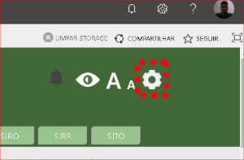

# SETCOS - Setor de Comunicação Social
!> Publicações sob responsabilidade da SETCOS. *(Conforme Portaria SJMA-DIREF - 10812964)*

## Administração do Site
> A [**página de administração**](https://trf1jusbr.sharepoint.com/sites/intranet-sjma/SitePages/Admin.aspx) é composta de tiles com links de administração para todo o conteúdo do portal.
O atalho de acesso está disponível direto na homepage em um botão localizado no canto superior direito em formato de engrenagem (que apenas usuários dos grupos de Administradores ou Proprietários tem acesso)

?> **Dica:** Para localizar o Menu Administrativo, 
basta observar o canto superior direito da intranet,
ao lado das opções de acessabilidade conforme a figura abaixo:

  

>Visão Geral do Menu de Administração

  

## Publicação de Notícias

>Para criar uma notícia, utilize o atalho disponível na página de administração do portal dentro da seção Páginas. A imagem abaixo destaca a opção dentro de Páginas em “Criar Página de Notícia”. 

  

>Abrirá a página padrão de criação de páginas com o layout de páginas de notícias selecionado. Insira o título da página e clique em “Criar” (a URL é automaticamente preenchida de acordo com o título da página).

!>Recomenda-se evitar o uso de espaços, caracteres especiais e acentuação no campo de “Nome da URL”.

  

>Ao clicar em “criar” o usuário será redirecionado automaticamente para a página de edição da notícia, conforme abaixo:

  

>Ao realizar uma edição ou criação, estarão disponíveis os seguintes campos para preenchimento:

!>* **Imagem da Notícia:** Utilize esse campo para inserir uma imagem que será exibida como miniatura na página inicial e na página que exibe todas as notícias;
* **Título:** Utilize esse campo para inserir um título na notícia, sendo este de preenchimento obrigatório, com limite de 255 caracteres;
* **Resumo:** Utilize esse campo para inserir um resumo sobre a notícia;
* **Categoria da notícia:** Utilize esse campo para selecionar a categoria da notícia (mais informações estão disponíveis no tópico Erro:** Origem da referência não encontrada);
* **Palavras-chave Corporativas:** Utilize esse campo para inserir as palavras-chave corporativas;
* **Data do Artigo:** Utilize esse campo para inserir a data da notícia;
* **Agendamento de Data de Início:** Utilize esse campo para inserir o agendamento da data de início, com o formato DD/MM/AA;
* **Agendamento de Data de Término:** Utilize esse campo para inserir o agendamento da data de término, com o formato DD/MM/AAA;
* **Tamanho do bloco:** Utilize esse campo para selecionar o tamanho do bloco;
* **Conteúdo da Página:** Utilize esse campo para inserir o conteúdo da página, sendo possível formatar, inserir imagens etc. utilizando os recursos nativos do SharePoint;
* **Fonte do vídeo:** Utilize esse campo para inserir a fonte do vídeo;
* **Conteúdo inferior:** Utilize esse campo para inserir o conteúdo inferior da página, sendo possível formatar, inserir imagens etc. utilizando os recursos nativos do SharePoint.

## Publicação de Avisos
## Calendário de Eventos Institucionais
## Produção Audiovisual
## Galeria
## Classificados
## Clipping
## Publicação de Banner
